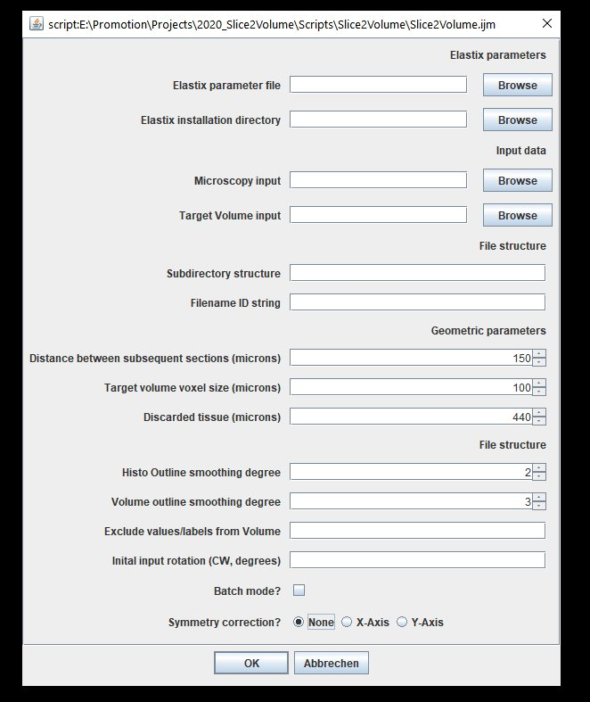
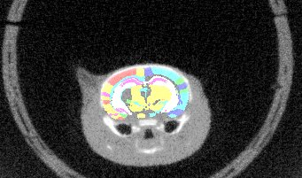
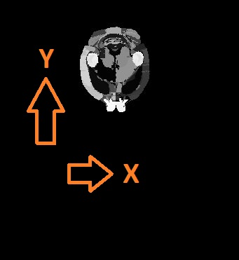

# Slice2Volume
Slice2Volume (S2V) is a script/wrapper that registers Histology slices of arbitrary resolutions to volumetric image data with Elastix registration tool.

|	| 	|  |
| --- | --- | --- |
| Overlay of co-aligned CT scan and brain atlas-staining	| Overlay of co-aligned CT scan and DAPI-staining		| Overlay of co-aligned brain Atlas and DAPI-staining |

### 1. Description

Reconstructing 3-dimensional volumes from single histological slices features the inevitable "banana problem". Aligning histological slices with a pre-defined volumetric image (CT, Atlas, etc) circumvents this problem.
S2V uses the volumetric image as ground truth volume image (target image), the histological images are transformed into the volumetric coordinate system with a contour based approach.

In short, the workflow follows the following steps:
1.  1. Downsampling of the histological image
    2. Creating a mask of the downsampled image and smoothing its outline
    
2.  1. Masking the target image (e.g. brain atlas) - certain regions can be croppped from the atlas if necessary
    2. Smoothing its outline
    
3. Identifying pairs of masks in volume image (i.e. binarized atlas) and histological masks. This works largely through information which has to be supplied beforehand, such as:
    * Distance (microns) between subsequent tissue cuts
    * Amount of tissue discarded (in microns) until the first section
    * Pixel spacing in the target volume in microns (example: 40 microns fpor DSURQE brain atlas)
    
4. Affine registration of these binary mask pairs with Elastix.

The output of S2V is as follows:
1. Downsampled and interpolated volumetric image of the transformed histological slices (see above)
2. Slice Assignment overview: Txt-File that lists the pairs of histological tissue sections (filename) and its corresponding slice in the volumetric image
    |Number|	File|	Depth|	Assigned slice|
    |-----|----|----|-----|
    |1|	\Data\Slices\0001_Scene_1/result/transformed_DAPI_r.tif|	500microns|	77|
    |2|	\Data\Slices\0001_Scene_2/result/DAPI_r.tif|	600microns|	78|
    |3|	\Data\Slices\0002_Scene_1/result/DAPI_r.tif|	800microns|	80|
3. (Inverse) Transformations: Transformix-readable transformation files that contain
    * the forward transformation: Will transform histological images into the coordinate system of the volumetric image
    * the backward transformation: transforms the selected slices (see slice assignment) into the coordinate system of the histological image.

### 2. Installations

A few pieces of software are recommended/necessary for the whole process. Here's a list:

* ImageJ/Fiji:
This free software is needed to execute the scripts. [Download link](www.imagej.net/Downloads)

* Elastix:
Necessary to run the registration. [Download link](elastix.isi.uu.nl)

### 3. Data requisites

#### File structure
S2V requires a certain file-naming convention with regard to the histological images as it is written for data obtained with slide-scanners. The numbering convention is XXXX_Scene_Y, where XXXX refers to the index of the coverslip object carrier, Y reffers to the index of the index of the sample of the object carrier

|root|0001_Scene_1|my_subdirectory|my_image.tif|
|----|----|----|----|
|    |0001_Scene_2|my_subdirectory|my_image.tif|
|    |...         |            ||
|    |0001_Scene_i|my_subdirectory|my_image.tif|
|    |0002_Scene_1|my_subdirectory|my_image.tif|

Example:
|	|
|----|
|Object carrier image|

#### Sample orientation
As you can see in the previous figure and the figure on the top, the histological images and the target volume do not necessarily have the same orientation. This can be corrected in the S2V GUI. Also, the 

### Usage
Now tell us already how to use it! Ok ok...here we go. This is the GUI:
|	|
|----|
|Slice2Volume user interface in Fiji|

I tried to make the script as versatile to different file structures and input data, but there are some necessary parameters to set:
* Elastix parameter file: This should be set to the file "elastix_parameters.txt" in the repository. 
* Elastix installation directory: Should be set to the directory tht contains elastix.exe and transformix.exe
* Microscopy input: This should be the root directory that contains all the separate slice data (root in the above example) 
* Target volume input: Path to the volumetric brain atlas file (e.g. DSURQE atlas) 
* Subdirectory structure: If your slice data has subdirectories (e.g. my_subdirectory in the bove example), put "my_subdirectory/" here. 
* Filename ID string: You may have other files in our slice directory; give a string here that identifies the image you would like to register (e.g. "my_image.tif" in the above example) 
* Distance between subsequent sections (microns): How far apart are your tissue sections?
* Target volume voxel size? (microns): Should be isotropic, for DSURQE it's 40microns. 
* Discarded tissue (microns): How much tissue was cut away from the sample until the sample 0000_Scene_1 was collected? 
* Histo outline smoothing degree: The higher this number, the smoother, the lower the more ragged the contour of the histological image will look. 
* Volume outline smoothing degree: Same as above, just for the volume image. 
* Exclude values/labels from Volume: if you want to remove particular labels (e.g. bulbus) from the volume image, list the corresponding values here, separated with a comma (100,101,102) or with a dash (101, 102, 110 - 120, 130, etc) 
* Initial input rotation: If, as shown above, the histological image has a different orientation than the atlas, you can either rotate the atlas or specify a degree (ideally multiple of 90) to rotate the histological image before registration 
* Batch mode off: See what's happening!
* Symmetry correction: This is relevant if, for instance your atlas was previously warped to match another data source (MRI, CT, etc). In that case, the atlas may be tilted (see figure below). The registration goes through the volume stack from slice to slice, it is assumed that the orientations match. If the atlas is tilted as shown below, this will not work any more. The symmetry correction provides a way out by rotating the atlas round the specified axis, until it is horizontally symmetrical. 

|	|	|
|------|------|
|Axial overlay of atlas and a CT: This atlas requires a symmetry correction. | Symmetry correction directions with respect to the plane orientation in the volumetric input|

### 4. Errors and Issues
S2V has not been tested extensively so if you find any issues, feel free to drop a message or open an issue :)

### 4. Citation
If you use S2V for a publication, please cite the following paper:
Suckert, et al. "High-precision image-guided proton irradiation of mouse brain sub-volumes." Radiotherapy and Oncology 146 (2020): 205-212.

