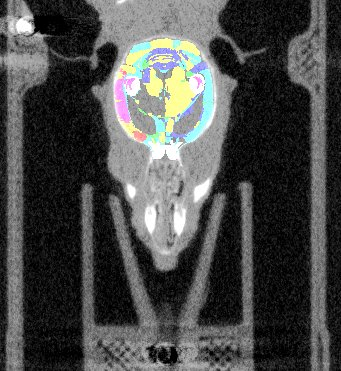
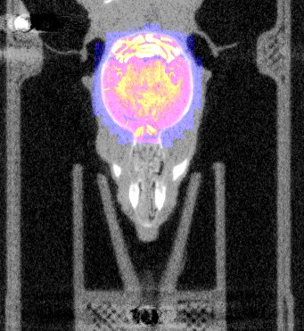

# Slice2Volume
Slice2Volume (S2V) is a script/wrapper that registers Histology slices of arbitrary resolutions to volumetric image data with Elastix registration tool.

|	|	||
|Overlay of co-aligned CT scan and brain atlas-staining	|Overlay of co-aligned CT scan and DAPI-staining		|Overlay of co-aligned brain Atlas and DAPI-staining|

### 1. Description

Reconstructing 3-dimensional volumes from single histological slices features the inevitable "banana problem". Aligning histological slices with a pre-defined volumetric image (CT, Atlas, etc) circumvents this problem.
The volumetric image serves as ground truth volume image (target image), the histological images are transformed according to binary masks of each slice. 

### 2. Installations

A few pieces of software are recommended/necessary for the whole process. Here's a list:
* MITK :
This free software is able to create masks from the a volumetric image (e.g. MRI, CT, brain atlas). You have to manually contour the CT images before starting with the registration. [Download link](www.mitk.org/wiki/Downloads)

* ImageJ/Fiji:
This free software is needed to execute the scripts. [Download link](www.imagej.net/Downloads)

* Elastix:
Necessary to run the registration. [Download link](elastix.isi.uu.nl)

### 3. Preparations on the PC
* Create directories
* Insert scripts

### 4. Script input
