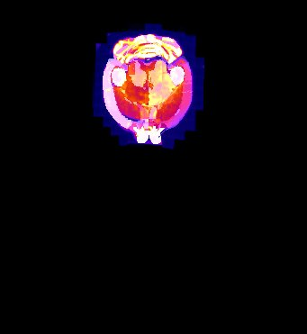

# Slice2Volume
Slice2Volume (S2V) is a script/wrapper that registers Histology slices of arbitrary resolutions to volumetric image data with Elastix registration tool.

|	| 	|  |
| --- | --- | --- |
| Overlay of co-aligned CT scan and brain atlas-staining	| Overlay of co-aligned CT scan and DAPI-staining		| Overlay of co-aligned brain Atlas and DAPI-staining |

### 1. Description

Reconstructing 3-dimensional volumes from single histological slices features the inevitable "banana problem". Aligning histological slices with a pre-defined volumetric image (CT, Atlas, etc) circumvents this problem.
S2V uses the volumetric image as ground truth volume image (target image), the histological images are transformed into the volumetric coordinate system with a contour based approach.

In short, the workflow follows the following steps:
1.  1. Downsampling of the histological image
    2. Creating a mask of the downsampled image and smoothing its outline
    
2.  1. Masking the target image (e.g. brain atlas) - certain regions can be croppped from the atlas if necessary
    2. Smoothing its outline
    
3. Identifying pairs of masks in volume image (i.e. binarized atlas) and histological masks. This works largely through information which has to be supplied beforehand, such as:
    * Distance (microns) between subsequent tissue cuts
    * Amount of tissue discarded (in microns) until the first section
    * Pixel spacing in the target volume in microns (example: 40 microns fpor DSURQE brain atlas)
    
4. Affine registration of these binary mask pairs with Elastix.

The output of S2V is as follows:
1. Downsampled and interpolated volumetric image of the transformed histological slices (see above)
2. Slice Assignment overview: Txt-File that lists the pairs of histological tissue sections (filename) and its corresponding slice in the volumetric image
    |Number|	File|	Depth|	Assigned slice|
    |-----|----|----|-----|
    |1|	\Data\Slices\0001_Scene_1/result/transformed_DAPI_r.tif|	500microns|	77|
    |2|	\Data\Slices\0001_Scene_2/result/DAPI_r.tif|	600microns|	78|
    |3|	\Data\Slices\0002_Scene_1/result/DAPI_r.tif|	800microns|	80|
3. (Inverse) Transformations: Transformix-readable transformation files that contain
    * the forward transformation: Will transform histological images into the coordinate system of the volumetric image
    * the backward transformation: transforms the selected slices (see slice assignment) into the coordinate system of the histological image.

### 2. Installations

A few pieces of software are recommended/necessary for the whole process. Here's a list:

* ImageJ/Fiji:
This free software is needed to execute the scripts. [Download link](www.imagej.net/Downloads)

* Elastix:
Necessary to run the registration. [Download link](elastix.isi.uu.nl)

### 3. Data requisites

#### File structure
S2V requires a certain file-naming convention with regard to the histological images as it is written for data obtained with slide-scanners. The numbering convention is XXXX_Scene_Y, where XXXX refers to the index of the coverslip object carrier, Y reffers to the index of the index of the sample of the object carrier

|root|0001_Scene_1|my_subdirectory|my_image.tif|
|----|----|----|----|
|    |0001_Scene_2|my_subdirectory|my_image.tif|
|    |...         |            ||
|    |0001_Scene_i|my_subdirectory|my_image.tif|
|    |0002_Scene_1|my_subdirectory|my_image.tif|

Example:
|	|
|----|
|Object carrier image|

#### Sample orientation
As you can see in the previous figure and the figure on the top, the histological images and the target volume do not necessarily have the same orientation. This can be corrected in the S2V GUI. Also, the 

### Usage
Now tell us already how to use it! Ok ok...here we go. This is the GUI:
|	|
|----|
|Slice2Volume user interface in Fiji|
